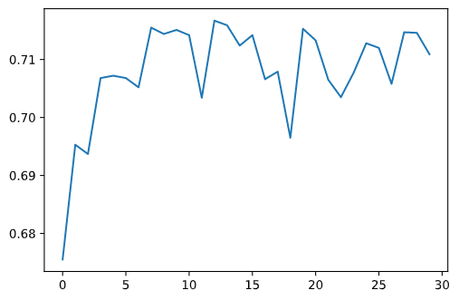
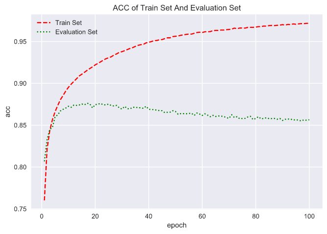
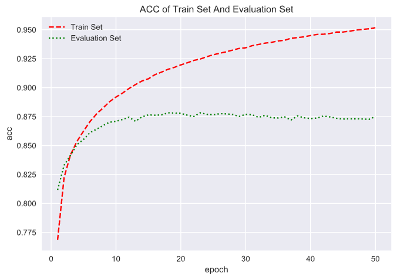
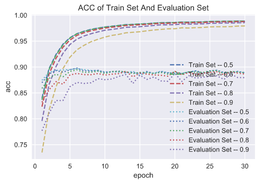
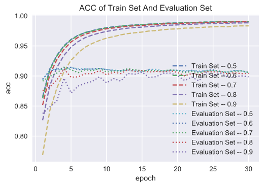

# 2020 中兴捧月算法大赛

参加了 2020 中兴捧月算法大赛, 图灵赛道, 赛程时间为 4.8-5.8, 赛前官方宣传图灵赛道题目方向为机器学习/数据挖掘/CV/NLP, 原来冲着试水一下机器学习的数据挖掘而参赛, 另外也觉得稍懂一点图像的知识, 即便是 cv 相关或许也可一战, 然而最终题目却为 nlp 方向的文本匹配.

一开始一脸懵逼, 一直处于弃赛状态(就像往常不好斗的自己一样), 毕竟完全 0 基础 nlp, 题目都不太看得懂......另外循环神经网络也没接触过, 题目涉及到变长序列的处理, 霸王硬上弓也不太方便。

## 1. 赛题

文本匹配, 相似性的二分类问题——

1. 给定三个文本文件, train.txt, test.txt, corpus.txt, 内容均为 nlp 中的文本向量;
2. train.txt 为已标注数据, 其中每一行含三个字段: text_a、text_b、label, 分别由\tab 键分隔, 依次代表文本 a、文本 b、文本 a 和 b 的相似性 (即是否表达同一语义), 总计约 250000 条. 示例如下:
   |条目|文本 a|文本 b|相似性(1/0)|
   |:---:|:---:|:---:|:---:|
   |1573 1730 8392 0 689 7 2702 \tab 96 1573 1730 8392 \tab 1|1573 1730 8392 0 689 7 2702|96 1573 1730 8392|1|
   |3500 1076 3865 22 3392 16096 5084 \tab 3500 1076 3865 2316 3392 225 \tab 0|3500 1076 3865 22 3392 16096 5084|3500 1076 3865 2316 3392 225|0|
3. test.txt 为未标注数据, 亦即待预测数据, 其每一行含两个字段: text_a、text_b, 需要建立模型预测他们的相似性标签, 总计 12500 条;
4. corpus.txt 为无监督语料库, 内容庞大, 约 2G 大小, 每行仅含一个字段: text, 即某自然语言文本对应的文本向量, 如上例中的 1573 1730 8392 0 689 7 2702. 不提供词表, 由选手自行选择是否使用此信息.

## 2. CNN 初探

4 月 30 日, 初赛还有约一周时间, 开始索性强行使用固定长度的 CNN 模型摸个鱼 —— 处理发现训练集 train.txt 和测试集 test.txt 中最长的文本序列均为 32 维, 于是强行把短于 32 维的文本向量填充到 32 维补齐, 输入 CNN/MLP 进行文本相似分类。4.30 起两三天, 纯 MLP 型的神经网络和 CNN 型的网络均有尝试, CNN 结果稍好, 最终选定 CNN 网络为主.

然而, 由于 CNN 强行补齐了文本向量, 最终分类准确率(acc)只能维持在 70%左右 (此时反思: 当时使用的 padding_value 好像为 0, 而文本序列本身含 0 ——不应该填充文本词表本身已含有的值, 比如应填充为-1 等, 不过, 我估计即使这样做了结果也不会有什么大提升):

> 2020/04/30
>
> 你的排名为第 259，分值为 60.417
>
> 你的排名为第 257，分值为 61.483
>
> 你的排名为第 256，分值为 62.083
>
> 你的排名为第 253，分值为 64.067
>
> 2020/05/01
>
> 你的排名为第 249，分值为 65.567
>
> 2020/05/02
>
> 你的排名为第 212，分值为 71.483
>
> 你的排名为第 213，分值为 71.483

## 3. RNN 初探

好像不得不使用 RNN 了, 最近笔面试也经常考到 RNN, 就像注定是个绕不过的坎儿, 硬着头皮上吧。RNN 原理来不及细抠了, 了解了下基本思想以及 PyTorch 的相关 API, 分别使用了`nn.RNN/LSTM/GRU`接口, 此题目下经过尝试三者效果无差别, 最终使用了`nn.LSTM`. rnn 为一层的时候效果一般, 一度气馁, 然而 rnn 的`num_layers=2`后效果小小爆炸, 线下测试集显示准确率冲上 80%. 再接再励, 将 num_layers 调为 3, 效果反而下降且模型变得震荡, 最终 num_layers 设为 2.

> 2020/05/04
>
> 你的排名为第 167，分值为 79.850
>
> 你的排名为第 152，分值为 80.967

此后进入 RNN 的各种参数暴力调试期, 杂五杂六的参数七上八下地调, 然收效甚微, 从未经历过强大如神经网络会欠拟合的情况, 训练集分数都总是上不去 80 就很糟心, 更奇葩的是测试集分数竟然持续性比训练集都高, 说明存在严重的欠拟合! 终于体会到神经网络的理论很美好、现实很残酷的处境, 这个领域确实还需要科研工作者/工程师前赴后继地研究下去. 慢慢陷入疲劳, 线上分数记录也懒得记了......

> 2020/05/05
>
> 78.333 2020-05-05 14:39:03
>
> 80.167 2020-05-05 17:31:07

-L5.png>)

## 4. VAE 编码???

此前一直没有利用到题目给的无监督文本序列 corpus.txt, 看人家说什么预训练, 小白如我实在是不知道怎么个利用法. 尽管一直觉察到题目是仅仅把文本分词、一个词汇对应分词者词表中那个词的序号, 而直接使用序号做文本的特征向量直觉上就很蹩脚, 但, 那又有什么办法呢?

海量无监督语料、特征向量、序号、编码......我靠, 我 TM 是做 VAE 的呀! VAE 是无监督学习方法, 可以利用 VAE 先把每一条无监督语料映射为隐变量空间作为编码, 如果生成器收敛, 这不就找到一个很好的特征向量吗, 利用这个特征向量做文本的编码应该要比蹩脚的序列号编码强吧?

我马上就着手敲起了 VAE 的实现, 写完编码器, 要下笔生成器时, 傻了, 怎么生成一个变长序列???

搜了各种序列深度生成模型的代码, 看了几天都一愣一愣的, 什么乱七八糟的, 我 RNN 的原理都没整明白呢, 看那一堆“字都认得、就是不看不懂嘛意思”的解释, 还有没几天时间初赛截止, 拉倒了......

## 5. seq2seq

代码一时写不出来, 但这些知识点迟早要会的吧, 不管比赛怎么样, 还是先一步一步掌握下原理吧. 于是开始看邱锡鹏老师《神经网络与深度学习》中序列生成模型那一章, 看到了一节叫 seq2seq, 只想说 woc woc woc, 这 TM 不就是我的"VAE"思想嘛, 果然我能想到的大佬们都想到了. 嗯, 好像这个叫 transformer 的很厉害, 哦, 这个叫 bert 的好像是现在的无敌战神......

PyTorch 的 API 直接就有 nn.Transformer, 再搜一下 transformer 的代码吧, 又看了一段时间, 知识点过于密集, 弃坑......

## 6. embedding

好吧, 死前再扑腾一下. 这几个 seq2seq 的模型里总是提到一个 embedding layer, 本质似乎就是一种向量空间转换, 关键的是它竟然是可学习的, 好赖加一个 `nn.Embedding` 层试一下算逑. 捣腾了 PyTorch 的相关 API, 终于在 RNN 层前、输入层后成功插入了一个 embedding 层. 有意栽花花不开, 无心插柳柳成荫, embedding 后效果好得嗷嗷叫, 训练集终于过拟合了, 准确率达到 98%, 说明模型学习能力总算提上来了, 目前的任务是提高泛化能力.

> 你的排名为第 122，分值为 83.917

## 7. 泛化提升

提高活化能力就很玄学了呀, 之前一直只用过提前停止法, 观察测试集分数啥时候达到最高就停止. 此外倒是一直听说神经网络的 dropout, 相当于集成学习, 试试吧——dropout 果然效果还不错, 不过指的是测试集后期的分数不会下降, 测试集曲线会趋平, 而非不加 dropout 的那种后期会下降和大幅波动, 不过测试集最高分却没什么提高.

似乎到此为止了, 这一趟打比赛虽然取得不了什么成绩, 但一周的时间里学习了 RNN 和 dropout, 也知足了.

## 8. 溯源

且慢, 其实一直以来都忽视了一个要素——训练集的正负样本分布情况 (也是最近面试到的一个回答得稀烂的题), 赛题的正负样本比例会不会严重不平衡呢? 赶紧写了统计代码——正例 143229 例, 负例 104771 例, 正负比$1.5:1$, 似乎有点较真的必要.

### 8.1 调阈值

正例过多, 会使得模型更倾向于将未知数据预判为正例, 也就是判断为正例的估计可能偏乐观了. 为保证客观, 应把正例的判定基准相应提升, 原来的概率估计 $p>0.5$ 即认为是正例, 看来应该以 $p>0.6$ 甚至 $p>0.7$、$p>0.8$、$p>0.9$ 为界, 通过测试找到最佳阈值吧.

选取了一个在我的线下测试集表现比较好的模型, 分别以 0.5, 0.7, 0.8, 0.85, 0.9 为阈值提交到线上进行打分, 结果 0.5 的时候分数 80 出头, 以 0.85 为界的分值最高, 达到历史新高 86.183 分, 排名 63, 喜出望外!

### 8.2 平衡训练集

初赛仅剩一天, 也没得什么折腾了, 唯一能做的就是再尝试下从训练时入手, 平衡下训练时的正负样本比例. 最好不要直接把多余的正例删除掉吧, 信息浪费; 那么通过手工造些负例样本点弥补不平衡吗? 咋造? ——无监督语料 corpus.txt!

自己随便造句操作上不并不是不可行, 但是你又不知道人家的词表咋划分的, 自己随便写了俩词其实根本不能组成一个句子怎么办? 最好的方法似乎是从给的无监督语料里随机抽出$2n$个句子, 因为是随机抽取, 况且现实世界中“随便说两名话, 他们表达的是同一个意思”这样一个概率事件发生的可能性是极低的, 所以抽取$2n$个句子再随机匹配成的$n$个文本对几乎可认为一定是不相似的, 即他们的标签是 0, 为负样本点.

如此便得以扩充平衡了训练集, “生成”约 50000 例负样本, 使得正负例样本点均为 143229 例, 重新学习训练, 线上提交.

不过线下测试集结果虽然由原来的最高 90 分提升到 92, 但线上 A 榜显示这样做却并没有得到什么收益, 最终也没有超过通过调阈值得到的最高分. 初赛时间已到, 没有了提交机会, 本次比赛宣告结束.

## 9. 止步初赛

5.14 日, 初赛 B 榜公布, 最终成绩 85.776 分, 排名 49. 也不知道是哪一次提交的结果, 还是非常想知道最后我那步生成负例进行训练是不是发挥了功效的.

榜首成绩 89.480, 听说前排使用的模型均是传说中的 bert, 曾经也想剑指 bert, 但段位还是太低了, 下次一定吧.

前 40 名晋级复赛, 前 66 名给予区域优胜奖, 止步初赛, 在意料之中.

本次比赛官方赛事群里入群 731 人, 预计参赛人员 800 左右? 第一次参加算法赛事, 虽有很多懵懂, 但在实战中着实受益匪浅, 果然还是“纸上得来终觉浅, 绝知此事要躬行”.

> 后记: 在研究阈值的时候应该试一下 ROC 曲线的, 多天然的一个应用机会啊, 奈何自我的很多知识其实都是泛而不深, 即使知道 ROC 曲线也根本意识不到它需要被信手拈来的场景, 在最后一天使用了全部 5 次提交机会后又看了一眼自己那么多条杂乱的阈值曲线才想到 ROC, 我该说什么呢?

